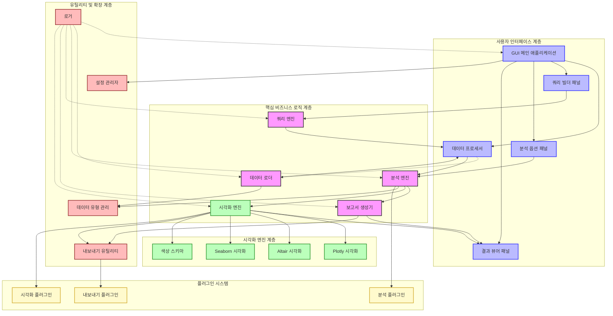
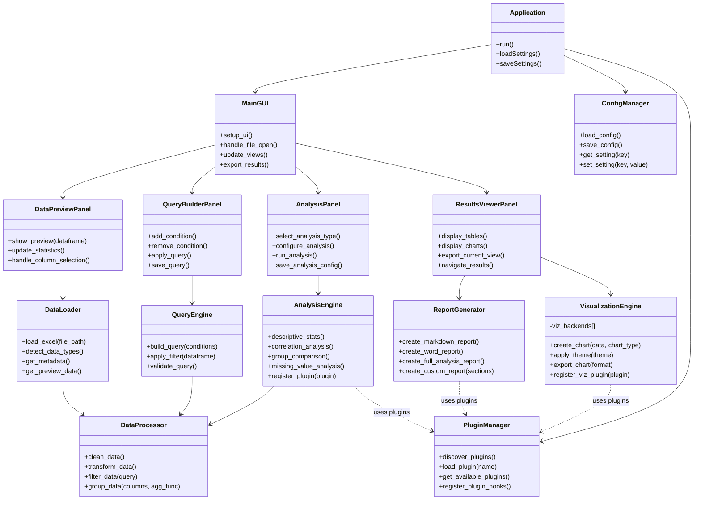
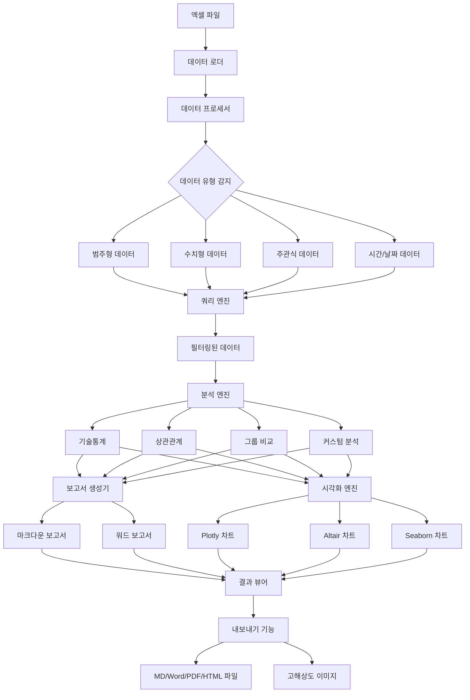
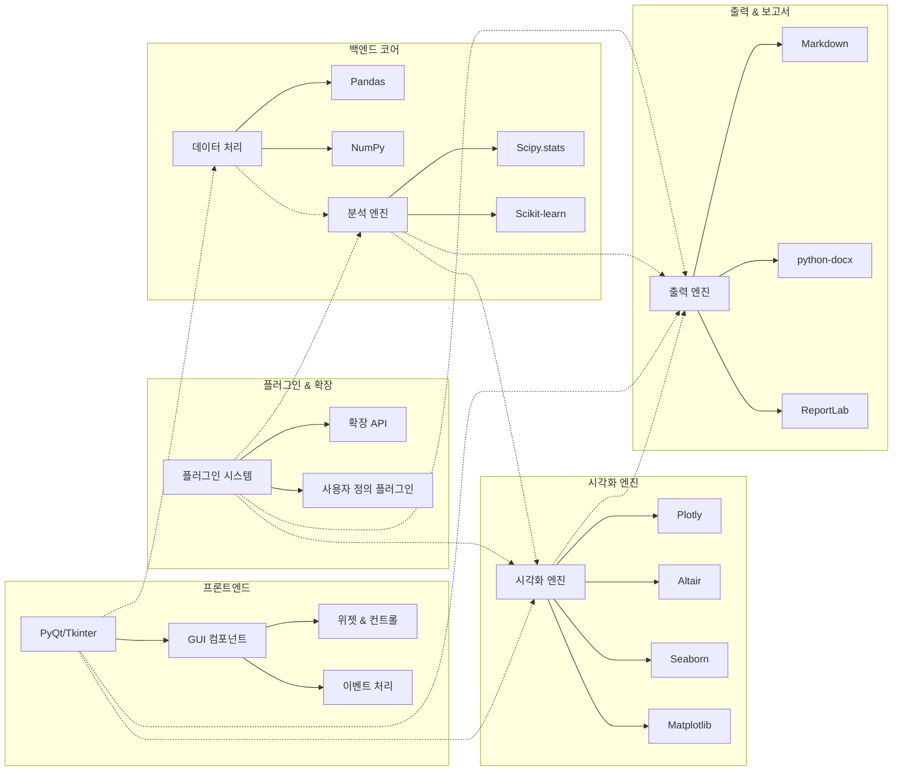
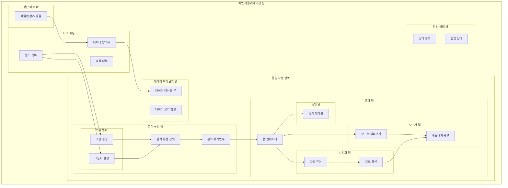
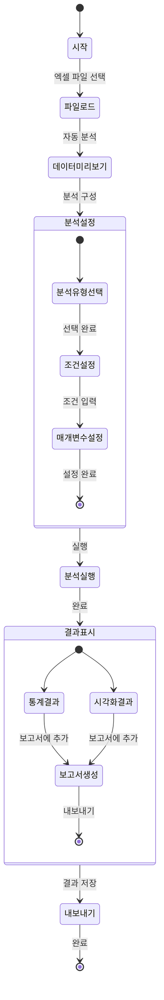
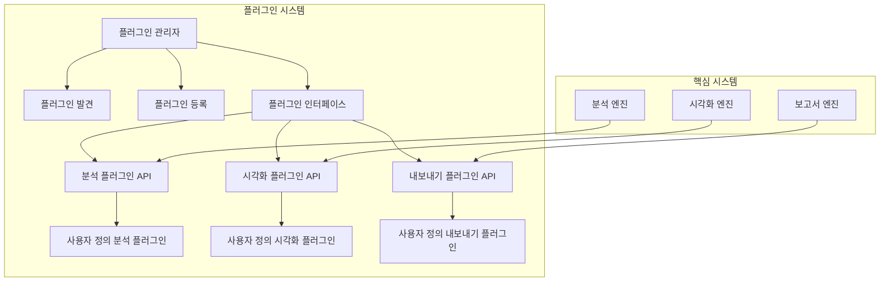

# 엑셀 분석기(Excel Analyzer) 요구사항 명세서

## 1. 개요

### 1.1 목적
본 문서는 엑셀 데이터 파일을 자동으로 분석하고, 고품질 시각화 및 보고서를 생성하는 소프트웨어 시스템의 요구사항을 정의합니다. 이 시스템은 데이터의 구조를 자동으로 분석하고, 다양한 형태의 결과물(시각화, 표, 텍스트 보고서 등)을 생성하여 데이터 분석 과정을 간소화합니다.

### 1.2 범위
이 시스템은 다음 기능을 제공합니다:
- 엑셀 데이터 파일 로딩 및 구조 분석
- 데이터 유형 자동 감지 및 분류(수치형, 범주형, 주관식 등)
- 기초 통계 분석 및 상관관계 분석
- 조건부 분석 및 그룹별 분석
- 고품질 시각화 자료 생성
- 마크다운 및 워드 형식의 보고서 생성
- 사용자 친화적 GUI 제공

### 1.3 주요 사용자 및 관계자
- 데이터 분석가 및 연구자
- 보고서 작성자
- 설문조사 결과 분석 담당자
- 통계 처리가 필요한 업무 담당자

## 2. 시스템 요구사항

### 2.1 기능적 요구사항

#### 2.1.1 데이터 로딩 및 분석
1. **파일 로딩**
   - 다양한 형식의 엑셀 파일(.xlsx, .xls, .csv) 로드 지원
   - 대용량 파일 처리 지원(메모리 효율적 처리)
   - 인코딩 및 시트 선택 옵션 제공

2. **데이터 구조 분석**
   - 열 데이터 유형 자동 감지(수치형, 범주형, 주관식, 날짜/시간 등)
   - 기본 통계 정보 추출(행 수, 열 수, 결측치 비율 등)
   - 데이터 품질 평가(결측치, 이상치, 중복 등)

3. **데이터 전처리**
   - 결측치 처리 옵션(제거, 대체 등)
   - 이상치 감지 및 처리
   - 데이터 변환 및 정규화 옵션

#### 2.1.2 분석 기능
1. **기술통계 분석**
   - 수치형 데이터: 평균, 중앙값, 최대/최소값, 표준편차, 분위수 등
   - 범주형 데이터: 빈도 분석, 비율 계산, 교차표 등
   - 결측치 분석: 열별 결측치 비율 및 패턴 분석

2. **상관관계 분석**
   - 수치형 변수 간 상관계수 계산(Pearson, Spearman 등)
   - 강한 상관관계 자동 감지 및 하이라이트
   - 상관 네트워크 분석

3. **그룹별 분석**
   - 지정한 범주형 변수 기준 그룹별 통계량 계산
   - 다중 그룹 비교 분석
   - 그룹 간 차이 검증

4. **조건부 분석**
   - 복잡한 조건 기반 데이터 필터링(예: "업력 10년 이상인 사람들의 체감난이도")
   - 직관적인 쿼리 빌더 UI 제공
   - 조건별 결과 비교 기능

5. **텍스트 분석(주관식 응답)**
   - 주관식 응답 정리 및 요약
   - 키워드 빈도 분석
   - 감성 분석 옵션

#### 2.1.3 시각화 기능
1. **자동 시각화 추천**
   - 데이터 유형에 적합한 시각화 방법 자동 추천
   - 다양한 차트 유형 지원(막대, 파이, 선, 산점도, 히스토그램, 박스플롯, 히트맵 등)

2. **고품질 시각화**
   - 웹 수준의 세련된 디자인
   - 일관된 색상 테마 및 스타일
   - 가독성 높은 레이블 및 범례
   - 시각적 계층 구조 최적화

3. **인터랙티브 시각화**
   - 확대/축소 및 패닝 기능
   - 도구 팁(tooltip)으로 상세 정보 표시
   - 필터링 및 데이터 하이라이팅
   - 인터랙티브 HTML 내보내기 옵션

4. **시각화 커스터마이징**
   - 색상, 글꼴, 크기 등 사용자 지정 옵션
   - 축 설정, 제목, 주석 등 조정 가능
   - 여러 차트 조합 및 배치 옵션

#### 2.1.4 보고서 생성
1. **마크다운 보고서**
   - 분석 결과 및 시각화를 포함한 마크다운 형식 보고서 생성
   - 주관식 데이터의 체계적 정리 및 요약
   - 사용자 정의 템플릿 지원

2. **Word 보고서**
   - Microsoft Word 형식 보고서 내보내기
   - 차트 및 표 포함
   - 스타일 및 레이아웃 옵션

3. **커스텀 보고서**
   - 분석 섹션 선택 및 조합 가능
   - 보고서 구조 사용자 정의
   - 요약 및 해석 텍스트 자동 생성 옵션

#### 2.1.5 사용자 인터페이스
1. **데이터 미리보기**
   - 데이터 로드 후 미리보기 제공
   - 열 유형 및 기본 통계 표시
   - 데이터 품질 이슈 하이라이트

2. **쿼리 빌더**
   - 직관적인 조건 설정 인터페이스
   - 드래그 앤 드롭 필터 구성
   - 복잡한 조건 시각적 표현

3. **분석 패널**
   - 다양한 분석 옵션 제공
   - 분석 설정 조정 인터페이스
   - 실시간 결과 미리보기

4. **결과 뷰어**
   - 분석 결과 및 시각화 표시
   - 결과 내비게이션 및 탐색
   - 내보내기 옵션

### 2.2 비기능적 요구사항

#### 2.2.1 성능 및 확장성
1. **성능**
   - 최소 10만 행, 100열 규모의 데이터 효율적 처리
   - 주요 분석 작업 30초 이내 완료
   - 메모리 사용량 최적화

2. **확장성**
   - 플러그인 기반 아키텍처로 새로운 분석 방법 및 시각화 쉽게 추가 가능
   - 모듈식 구조로 유지보수 및 확장 용이
   - 사용자 정의 분석 플러그인 지원

#### 2.2.2 사용성
1. **사용자 친화적 인터페이스**
   - 직관적인 작업 흐름
   - 기술적 배경 없는 사용자도 쉽게 사용 가능
   - 컨텍스트 도움말 및 가이드 제공

2. **응답성**
   - 사용자 작업에 즉각적인 피드백 제공
   - 긴 작업 시 진행 상황 표시
   - 비동기 처리로 UI 응답성 유지

#### 2.2.3 호환성 및 이식성
1. **크로스 플랫폼**
   - Windows, macOS, Linux 지원
   - 최소한의 외부 종속성

2. **파일 형식 호환성**
   - 다양한 엑셀 형식 지원(.xlsx, .xls, .csv, .ods 등)
   - 결과물 다양한 형식 내보내기(MD, DOCX, PDF, HTML, PNG, SVG 등)

#### 2.2.4 보안 및 데이터 관리
1. **데이터 보안**
   - 모든 데이터 로컬 처리(외부 서버 전송 없음)
   - 민감 데이터 마스킹 옵션

2. **설정 관리**
   - 사용자 설정 저장 및 복원
   - 분석 구성 저장 및 공유 기능

## 3. 시스템 아키텍처

### 3.1 주요 모듈 구성
시스템은 다음과 같은 주요 모듈로 구성됩니다:

1. **데이터 로딩 및 분석 모듈**
   - 다양한 형식의 엑셀 파일 로딩
   - 데이터 구조 자동 분석
   - 기초 통계 계산

2. **데이터 변환 및 처리 모듈**
   - 데이터 정제 및 변환
   - 파생 변수 생성
   - 데이터 그룹화 및 필터링

3. **분석 모듈**
   - 기술통계 분석
   - 상관관계 분석
   - 그룹별 비교 분석
   - 조건부 분석

4. **시각화 모듈**
   - 차트 생성(막대, 파이, 산점도, 히스토그램 등)
   - 상관관계 시각화
   - 그룹별 비교 시각화

5. **보고서 생성 모듈**
   - 주관식 응답 MD 형식 정리
   - 통계 결과표 생성
   - 시각화 자료와 텍스트 통합

6. **GUI 인터페이스**
   - 데이터 로드 및 미리보기
   - 분석 옵션 설정
   - 결과 표시 및 내보내기

7. **설정 및 확장 모듈**
   - 사용자 설정 저장/로드
   - 플러그인 시스템

#### 3.1.1 시스템 아키텍처 다이어그램

#### 3.1.2 컴포넌트 클래스 다이어그램

### 3.2 데이터 흐름
시스템의 데이터 흐름은 다음과 같습니다:

1. 엑셀 파일 로딩
2. 데이터 구조 분석 및 유형 감지
3. 데이터 전처리 및 정제
4. 필터링 및 그룹화(조건부 분석용)
5. 분석 수행(통계, 상관관계 등)
6. 시각화 및 보고서 생성
7. 결과 표시 및 내보내기

#### 3.2.1 데이터 흐름도

### 3.3 기술 스택
시스템 구현에는 다음과 같은 기술이 사용됩니다:

1. **프로그래밍 언어**: Python
2. **데이터 처리**: pandas, numpy
3. **시각화**: 
   - Plotly: 인터랙티브하고 세련된 그래프
   - Altair: 선언적 방식의 시각화
   - Seaborn: 통계 시각화
   - Matplotlib: 기본 그래프 엔진
4. **GUI**: PyQt 또는 Tkinter
5. **보고서 생성**: Markdown, python-docx
6. **의존성 관리**: pip, conda

#### 3.3.1 기술 스택 구성도

## 4. 인터페이스 요구사항

### 4.1 사용자 인터페이스
시스템의 GUI는 다음과 같은 주요 화면으로 구성됩니다:

1. **메인 화면**
   - 파일 로드 및 설정 메뉴
   - 데이터 미리보기 및 요약 정보
   - 분석 옵션 선택 영역
   - 결과 표시 영역

2. **데이터 미리보기 패널**
   - 데이터 테이블 뷰
   - 열 유형 및 통계 요약
   - 데이터 품질 지표

3. **쿼리 빌더 패널**
   - 조건부 분석을 위한 조건 설정
   - 필터 구성 및 적용
   - 조건 결과 미리보기

4. **분석 옵션 패널**
   - 분석 유형 선택
   - 분석 파라미터 설정
   - 그룹화 및 집계 옵션

5. **결과 뷰어 패널**
   - 탭 기반 결과 표시
   - 시각화 및 테이블 표시
   - 내보내기 옵션

#### 4.1.1 사용자 인터페이스 목업

#### 4.1.2 사용자 작업 흐름도

### 4.2 소프트웨어 인터페이스
시스템은 다음과 같은 외부 인터페이스를 제공합니다:

1. **파일 시스템 인터페이스**
   - 엑셀 파일 읽기
   - 결과 파일 내보내기(MD, DOCX, PDF, PNG 등)

2. **플러그인 인터페이스**
   - 사용자 정의 분석 플러그인
   - 사용자 정의 시각화 플러그인
   - 사용자 정의 내보내기 플러그인

#### 4.2.1 플러그인 아키텍처

## 5. 품질 속성

### 5.1 성능
- 10만 행 규모의 데이터셋 분석 시 메모리 사용량 2GB 이하
- 기본 분석 작업 완료 시간 30초 이내
- 시각화 생성 시간 5초 이내

### 5.2 사용성
- 새 사용자가 기본 분석을 수행하는 데 10분 이내 소요
- 주요 작업에 최대 3단계 이하 필요
- 오류 메시지는 명확하고 해결책 제시

### 5.3 신뢰성
- 잘못된 입력에도 충돌 없이 적절한 오류 메시지 제공
- 긴 작업 중 저장 지점 제공으로 작업 복구 가능
- 모든 결과에 사용된 데이터 및 방법론 추적 가능

### 5.4 확장성
- 새로운 분석 방법 추가에 1일 이내 개발 가능
- 플러그인 시스템으로 코어 코드 수정 없이 기능 확장 가능
- 사용자 정의 시각화 템플릿 추가 지원

## 6. 제약사항 및 가정

### 6.1 제약사항
- 처리 가능한 최대 데이터셋 크기는 사용자 시스템의 메모리에 의존
- 복잡한 분석의 경우 처리 시간이 길어질 수 있음
- 시각화의 세부 사항은 사용된 시각화 엔진에 따라 달라질 수 있음

### 6.2 가정
- 사용자는 기본적인 데이터 분석 개념에 익숙함
- 입력 엑셀 파일은 기본적인 구조적 일관성을 가짐
- 시스템은 로컬 환경에서 실행됨

## 7. 우선순위 및 릴리스 계획

### 7.1 핵심 기능(MVP)
1. 엑셀 파일 로딩 및 기본 구조 분석
2. 기본 통계 분석(기술통계, 빈도 분석)
3. 기본 시각화(막대 차트, 파이 차트, 히스토그램)
4. 간단한 보고서 생성(MD 형식)
5. 기본 GUI 인터페이스

### 7.2 확장 기능(2차 릴리스)
1. 고급 분석 기능(상관관계, 그룹별 분석)
2. 고급 시각화(인터랙티브 차트, 히트맵)
3. 조건부 분석을 위한 쿼리 빌더
4. Word 형식 보고서 내보내기
5. 사용자 설정 저장 및 불러오기

### 7.3 고급 기능(3차 릴리스)
1. 플러그인 시스템
2. 텍스트 분석 기능(주관식 응답)
3. 고급 인터랙티브 시각화
4. 커스텀 보고서 템플릿
5. 일괄 처리 및 자동화 기능

## 8. 부록

### 8.1 용어 정의
- **기술통계**: 데이터셋의 주요 특성을 요약하는 통계량(평균, 중앙값, 표준편차 등)
- **상관분석**: 두 변수 간의 관계 강도와 방향을 측정하는 통계적 방법
- **범주형 데이터**: 제한된 수의 범주나 그룹으로 구분되는 데이터
- **수치형 데이터**: 연속적인 값을 가지는 수치로 표현되는 데이터
- **주관식 데이터**: 자유 형식의 텍스트 응답

### 8.2 관련 도구 및 기술
- **pandas**: Python 데이터 분석 라이브러리
- **Plotly**: 인터랙티브 시각화 라이브러리
- **PyQt**: Python GUI 프레임워크
- **Markdown**: 경량 마크업 언어

---

문서 작성일: 2023년 4월 7일
버전: 1.0 